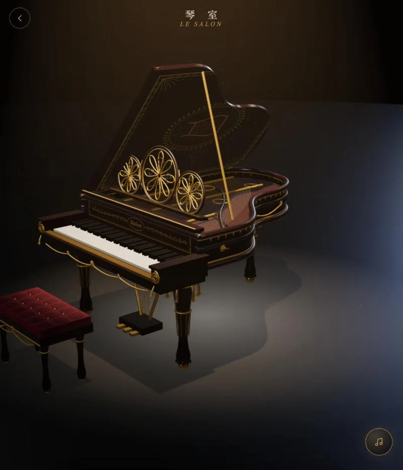

# Le Salon · 琴室

<p align="center"></p>

<p align="center"><b><a href="https://kuik82281-arch.github.io/le-salon/">在线试用 · Try it online</a></b><br><sub>试用页没有接 AI 和 Qwen：可以听内置曲目、亲手弹。<br>The demo has no AI or Qwen connected: you can listen to the built-in pieces and play it yourself.</sub></p>

一架用代码雕出来的三角钢琴，独自站在黑暗舞台的一束聚光里。你的 AI 可以弹给你听：自己写谱，或者只说一个歌名，让本地的 Qwen 去曲库找谱，钢琴自己弹。琴键会跟着音乐按下去。

A grand piano carved in code, alone in one spotlight on a dark stage. Your AI can play it for you — writing the piece
itself, or just naming a song and letting a local Qwen model find the score while the piano plays it. The keys go
down with the music. [English below](#english).

## 能做什么

- **一架雕花的琴**：88 个琴键各自独立，琴身一圈金色串珠、齿饰、玫瑰和垂花，弯腿有叶饰和爪球脚，踏板是一把竖琴，
  琴盖内侧画着金色蔓藤，乐谱架是镂空的金色圆花，配一张丝绒琴凳。全部程序建模（Three.js），没有外部模型文件。
- **舞台**：四周黑暗，一束暖光从上方打下来，光柱里飘着微尘；镜头慢慢绕着钢琴转，也可以拖动和缩放。
- **琴键会动**：弹奏时每个琴键按下去，敲到的那一下微微发光；直接点琴键也能弹。合上琴盖时，乐谱架先折平，撑杆收起。
- **AI 弹给你**：
  - `play`：AI 用一种简洁的谱写法（一行一只手，`C4/1 E4+G4/2 R/1`，可以有力度和踏板）写一首弹给你；
  - `request`：只说歌名。本地的 Qwen（Ollama 的 `qwen2.5:3b`）把歌名翻成曲库里的英文名，去 [BitMidi](https://bitmidi.com)
    搜 MIDI，再从结果里挑出真正是那首的文件，钢琴就开始弹。不用写谱，几乎不花 token；
  - 页面开着就会立刻开始弹（浏览器要求第一次出声前点一下，所以会出现「轻触 · 聆听」）。
- **点歌**：面板里有一栏，自己输入歌名，同样由 Qwen 去找。
- **亲手弹**：88 个键一次全摆在下面，不用翻页（带延音），电脑键盘也能弹（A–L 白键，W E T Y U O P 黑键，Z/X 换八度，空格延音）。
- **声音**：合成的琴音（略微失谐的两根弦、毡锤的敲击声），加上音乐厅的混响。不是录音采样。

## 跑起来

需要 Node.js 22.18 或更新版本（直接运行 `.ts`）。点歌需要本地装好 [Ollama](https://ollama.com) 并拉取 `qwen2.5:3b`。

```bash
npm install
npm run server   # 接口，http://localhost:7532
npm run dev      # 另开一个终端：页面，http://localhost:5173
```

或者构建好由服务器一起提供：`npm run build && npm start`，然后打开 http://localhost:7532。

数据存在 `data/piano.json`（可以用 `DATA_DIR` 改位置）。`OLLAMA_URL`、`SALON_QWEN_MODEL` 可以换 Ollama 的地址和模型。

## 接你的 AI

### MCP（Claude Desktop、Claude Code 或任何支持 MCP 的 agent）

先跑起 `npm run server`，再把 MCP 服务器加进你的客户端，例如 Claude Desktop 的 `claude_desktop_config.json`：

```json
{
  "mcpServers": {
    "le-salon": { "command": "node", "args": ["/path/to/le-salon/server/mcp.ts"], "env": { "SALON_URL": "http://localhost:7532" } }
  }
}
```

工具：`play`（自己写谱弹）、`request`（报歌名，Qwen 找谱）、`recent`（最近弹过的）。

### HTTP

```
GET  /api/piano            -> { performances }
POST /api/piano/play       { title, note?, bpm?, voices: ["E4/1 D4/1 C4/2", "C3+G3/4"] } -> { performance }
POST /api/piano/request    { song, by?: "ai" | "user", note? } -> { performance }
GET  /api/updates          event stream: `piano` { performance }
```

设了 `SALON_TOKEN` 的话，AI 的请求要带 `Authorization: Bearer <token>`。

### 边听边聊（聊天小窗）

琴室左下角有个小窗，可以一边听琴、一边和模型聊天（拖标题栏移动，点 – 收成小气泡）。它走 `POST /api/chat { messages, context }`，转给任何 OpenAI 兼容的模型，每次都附上"现在在弹什么"。默认用本地 Ollama 的 `qwen2.5:3b`；换别的模型设这几个环境变量：

```
CHAT_BASE_URL=https://api.example.com/v1   # OpenAI 兼容的 /v1
CHAT_MODEL=your-model
CHAT_API_KEY=...
CHAT_SYSTEM=它是谁、怎么说话
```

想接自己的后台：`PianoRoom` 收一个 `chat` 适配器（`src/piano/SalonChat.tsx` 的 `SalonChatAdapter`，一个 `send(messages, context) => Promise<string>`）；不传就没有小窗。

## 谱子怎么写

一行一只手（或一个声部），所有行同时从头开始；`bpm` 是速度（默认 90）。

| 写法 | 意思 |
|---|---|
| `C4/1` | 中央 C，一拍 |
| `F#3/0.5` `Bb2/2` | 升降号 |
| `E4+G4+C5/2` | 和弦，两拍 |
| `R/1` | 休止一拍 |
| `C5/1!0.95` | 重一点（力度 0.01–1） |
| `\|` | 小节线，只为好读 |
| `pedal: 0 4 4 8` | 第 0 拍踩下延音、第 4 拍抬起、再踩下、第 8 拍抬起 |

## 来源与许可

钢琴的琴形、88 键、合成音和播放器改编自 Piano Atelier（本项目作者的另一个作品），在此基础上雕刻、布光并接入 AI。
三维用 [Three.js](https://threejs.org)（MIT），MIDI 来自 [BitMidi](https://bitmidi.com) 的公开曲库。

AGPL-3.0-or-later，见 [LICENSE](LICENSE)。

---

## English

**What it does.** A carved grand piano — 88 separate keys, a gilded rim with beading, dentils, rosettes and garlands,
cabriole legs with acanthus knees and claw-and-ball feet, a lyre for the pedals, a painted lid lining, an openwork
music desk and a velvet bench, all modelled in code — alone on a dark stage under one spotlight, dust drifting in the
beam. The keys go down with the music and glow a little when struck; tap a key to play it. Your AI can `play` a piece
it writes in a compact notation (one line per hand), or `request` a song by name: a local Qwen model (Ollama,
`qwen2.5:3b`) names it in English, searches the BitMidi archive, picks the file that really is that song, and the
piano plays it — no score to write, almost no tokens. You can ask for songs in the panel too, and play by hand on a
strip of all 88 keys or your computer keyboard.

**Run it.** Node.js 22.18+. `npm install`, then `npm run server` (API on :7532) and `npm run dev` (page on :5173), or
`npm run build && npm start`. Song requests need Ollama with `qwen2.5:3b`.

**Chat while it plays.** A small window talks to any OpenAI-compatible model via `POST /api/chat` (`CHAT_BASE_URL`,
`CHAT_MODEL`, `CHAT_API_KEY`, `CHAT_SYSTEM`; default: local Ollama `qwen2.5:3b`), or pass your own `chat` adapter to `PianoRoom`.

**Connect your AI.** Add `server/mcp.ts` as an MCP server (it calls the running HTTP server at `SALON_URL`); tools:
`play`, `request`, `recent`. Or use the HTTP API above.

**Credits.** The piano's outline, keys, synthesis and player are adapted from Piano Atelier, by the same author.
Three.js (MIT); MIDI files from the public BitMidi archive. Licensed AGPL-3.0-or-later.
